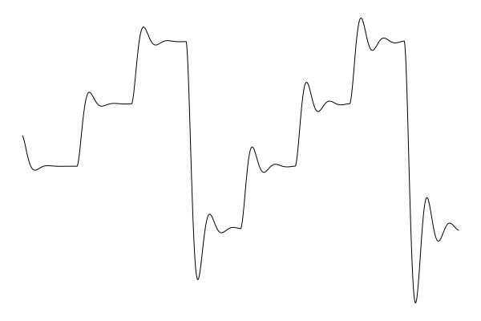

  

tt05-synth -- Analog inspired monosynth
=======================================
tt05-synth is a small analog inspired monosynth implementation in silicon to be taped out as part of tapeout TT05 at https://tinytapeout.com, using an area of 160 x 200 um in a 130 nm CMOS process.

The synth has
- Two oscillators
    - individually selectable waveforms: saw/square/25% pulse/noise
- A second order lowpass filter
    - adjustable input volume, cutoff frequency, and resonance,
    - choice to feed in each oscillator to create a first or second order roll off,
    - saturation when overdriven -- a high input volume can create massive overdrive
- Programmable sweep rate for
    - the two oscillator frequencies,
    - the input volume, cutoff frequency, and resonance
- Pseudologarithmic scale for all controls using a simple floating point representation

The output is generated using Pulse Width Modulation, with dithering to add additional resolution for lower frequencies.
There is also an 8 bit output for the sample, but the PWM output should be easier to use.

The synth is intended to be clocked at 50 MHz and generate one sample every 32 cycles, or at `sample_rate = 1.5625 MHz`. Only 6 cycles are actually needed to generate a new sample, but using 32 cycles provides increased PWM resolution. The maximum oscillator frequency is `sample_rate/512`, or 3052 Hz if clocked at 50 MHz.

A recording of a demo tune played on the `tt05-synth` hardware can be found at https://youtu.be/ed3JROdFSls.

Signal flow
-----------

    oscillator 1 -> volume gain \
                                 filter -> output
    oscillator 2 -> volume gain /

Pins
----
The top module has IO 24 pins:
- `ui_in[7:0] = w_data`: write data (input)
- `uio_in[3:0] = w_addr`: write address (input)
- `uio_in[6] = pwm` (output)
- `uio_in[7] = w_strobe`: write strobe (input)
- `uo_out[7:0] = sample`: 8 bit sample

There is also a clock and a synchronous reset.

**Caution!: Be sure that you know what you are doing when trying to connect an audio device to the `pwm` (or `sample`) signals!
Do not apply more than 1 V between the terminals of an audio plug that is connected to an audio input, or it might take damage!
Use an appropriate resistive divider to reduce the output voltage. Do not draw more than absolutely maximum 4 mA from the TT05 outputs to avoid damaging them!**

Controlling the sound
---------------------
The synth has an address space of 16 bytes for control registers, which control the generated sound.

### Writing to the control registers
To write a byte to a control register:
- Keep `w_strobe` low normally
- Apply the desired address and data to `w_addr`, `w_data`
- Pulse `w_strobe` high for at least 10 clock cycles
- Keep `w_addr`, `w_data` stable during the same time
- `w_addr`, `w_data` should be sampled 2-10 cycles after the rising edge of `w_strobe`

### Memory map
Most control registers consume 16 bits of address space each.
The memory map is laid out as follows: (one 16 bit word per line)

    offset |  high byte |     low byte |
    -------|------------|--------------|
     0     |        osc1_period        |
     2     |        osc2_period        |
     4     |      cutoff_period        |
     6     |        damp_period        |
     8     |         vol_period        |
    10     | osc2_sweep |   osc1_sweep |
    12     | damp_sweep | cutoff_sweep |
    14     |        cfg |    vol_sweep |

### Control registers
All control registers except `cfg` are expressed in terms of periods, which in turn control frequencies.
The periods are expessed in a simple floating point format with 4 bit exponent and 9, 5, or 3 bit mantissa for the oscillator periods,
cutoff/damp/volume periods, and sweep periods respectively. The sweep periods also have a sign bit.

The floating point format means that increasing the exponent for a period by one step lowers the frequency by one octave.
The exception is that for all periods, an exponent of 15 turns results in a frequency of 0, which can be used to turn off an oscillator, sweep, etc.

At reset, the control registers are initialized to all ones, resulting in an output at zero volume and frequency.

#### Oscillators
The oscillator frequency is given by

    osc_freq = sample_rate / (2^osc_period[12:9] * (512 + osc_period[8:0]))

for a maximum oscillator frequency of 3052 Hz, where `osc_period` is `osc1_period` or `osc2_period`.
An decrement of one to `osc_period` corresponds to a frequency increase of 1.69 to 3.38 cents, depending on the mantissa `osc_period[8:0]`.
Detuning the two oscillators by up to 10 cents can add a nice depth and fatness to the sound.
Detuning by approximately an octave, a fifth, or a fourth can also provide interesting effects.

#### Cutoff, volume, and damping
The cutoff frequency is approximately given by

    cutoff_freq =  sample_rate * 4 / (2 * pi * 2^(cutoff_period[8:5]) * (32 + cutoff_period[4:0]))

for a maximum cutoff frequency of 31085 Hz.
As `cutoff_freq` increases above `osc_freq`, the output signal gains in harmonics.
As it decreases below, the whole signal starts to be damped out.

The filter's resonance and input volume are determined by the relation between cutoff frequency on the one hand, and the damping/volume frequencies on the other. The damping and volume frequencies are calculated in the same way as `cutoff_freq`, but using the corresponding periods.

The volume gain used to feed the two oscillators into the filter is given by

    vol_gain = vol_freq / cutoff_freq

The resonance of the filter is approximately given by

    Q = cutoff_freq / damp_freq

A too high `vol_gain` or, too high `Q`, or both, will saturate the filter. This can be a desirable effect in some case,
but drastically alters the effect of detuning the oscillators.
A neutral starting point can be

    vol_gain = 1/4
    Q = 1

which provides some margin before saturating the filter.

#### Frequency sweeping
The sweep frequency is given by

    sweep_freq = sample_rate / (4 * 2^sweep_period[6:3] * (8 + sweep_period[2:0]))

where `sweep_period = osc1_sweep, osc2_sweep, cutoff_sweep,... ` etc.
With a rate of `sweep_freq`, the corresponding period register will be increased/decreased by one, depending on `sweep_period[7]`:
0 to increase the period and 1 to decrease it.

Sweeping can be used to sweep the oscillator and cutoff frequencies as well as the resonance and input volume.
By updating the sweep frequencies at certain times, envelopes can be realized.

#### Waveform
The waveform for oscillator 1 is controlled by `cfg[1:0]`, and for oscillator 2 by `cfg[3:2]`:
- 0: pulse wave (25% duty cycle)
- 1: square wave
- 2: noise
- 3: 2 bit sawtooth wave

#### Filter fall-off
Each oscillator can be fed into the filter in one of two ways, depending on `cfg[6]` / `cfg[6]` for oscillator 1 / 2:
- 0: First order fall-off
- 1: Second order fall-off

How to test
-----------
Some test code using the microPython SDK (default firmware) can be found in [tt05.py](tt05.py).
Note that microPython is quite slow at writing the registers, which will cause audible and unpleasant artifacts
when trying to update more than one register at the same time.

The https://github.com/toivoh/tt05-synth-rp2040 repository contains an alternate firmware that can send commands
much quicker to the synth, more developed code for forming the commands, and a demo tune.

How it works
------------
The main components are
- Oscillators
- Control oscillators for volume, cutoff, and damping
- Sweep oscillators
- Filter
- PWM

The design is inspired by analog synths.
A simple classic analog synth could contain
- a few oscillators with a choice of waveforms, summed together,
- a voltage controlled filter (VCF) with voltage controlled cutoff frequency and controllable resonance (often through a potentiometer),
- a voltage controlled amplifier (VCA),
- envelopes and low frequency oscillators (LFOs) to generate control voltages for the oscillators (pitch), VCF, and VCA.

Control voltages are generally passed through an exponential converter, so that a linear change in voltage gives in exponential change in frequency or amplitude.

In tt05-synth, the amplifier stage is placed before feeding the oscillator signal into the filter, because it produces more interesting results:
a high gain causes the filter to saturate, changing the waveform and causing intermodulation between the oscillator waveforms.
The sweeps can be used to create very simple envelopes. With occasional external updates, they can be used to generate more complex control waveforms, including effects such as ADSR envelopes and LFOs.

The analog inspiration is not seen just in the components of the synth, but also in the floating point representation of the controls and the implementation of the filter.

Another important theme of the design is to keep the complexity to low, to save on silicon area. To this end, the design tries to
- use as few bits as needed (flip flops are big), and
- reuse logic when practical.

More bits could have been saved, more logic reused, and the area could have been used to implement more features. But that is for another tapeout.

### Oscillators
Each waveform oscillator uses a period of `2^osc_period[12:9] * (512 + osc_period[8:0])` samples.
By using a period that is a whole number of samples, the waveform becomes exctly periodic, and inharmonic aliasing is avoided.
The frequency resolution is chosen so that the smallest frequency step, `513/512`, or roughly 3.38 cents, is smaller than the just noticeably difference, assumed to be greater than cents. This also allows for a useful detuning range of a few frequency steps.

A range of 16 octaves is clearly overkill. A range of 8 octaves from 12 Hz to 3052 Hz might have been sufficient,
but supporting a few octaves below the audible range helps when sweeping the frequency down.

A 10 bit counter   to generate a waveform with the desired period.
In the simplest form, the counter would count down by one each sample, triggering and adding `512 + osc_period[8:0]` if the counter would otherwise become negative.
This allows to create a `waveform_period` that is 512 to 1023 times `sample_rate`.

To be able to create a sawtooth waveform, the counter instead counts down by `2^n_saw` each sample, still triggering when needed.
Each time the counter triggers, an `n_saw` bit counter called `saw` is increased by one. This `saw` wraps around once per `waveform_period`.

#### Floating point format for periods, exponential conversion
To support lower octaves, the synth contains a clock divider. `n = osc_period[12:9]` is used to select an enable signal from the clock divider, so that the counter is only updated once per `2^n` samples. When `n = 15`, the enable signal is made always low, to be able to stop an oscillator.

The floating point representation causes the relative frequency accuracy to be same for each octave, saving bits compared to a linear representation of the period.
It also acts as a pseudo-exponential converter, so that sweeps of cutoff frequency, volume, etc, have an exponential progression.
The result is a piecewise linear approximation of an exponential function, but I have not noticed any ill audibly ill effects from this.

#### Control oscillators
Control oscillators have a lower resolution with only 5 bits mantissa. This is based on listening tests where I let cutoff frequency or volume sweep down, to see where I would start to hear stepwise motion. 4 bits might have been ok as well.
Otherwise, control oscillators work very much like waveform oscillators except for one important difference:
a higher exponent doesn't cause the oscillator to trigger less often, insted, the filter is updated by a smaller step. More about this in the filter section.

An 8 octave range for the control oscillators would not have been enough. To begin with, the highest cutoff frequency is about 30 kHz, to make sure that the filter can act as if completely open. An 8 octave range would only allow it to go down to about 120 Hz. When the cutoff frequency sweeps down, I needs to go a number of octaves below the oscillator frequency before the output can no longer be heard.

#### Sweep oscillators
Sweep oscillators have an even lower resolution with only 3 bits of mantissa, to save bits.
Each time on triggers, the corresponding period is increased or decreased by one.

The 16 octave range for sweep oscillators is very useful to be able both to quickly sweep a frequency from the top octave to the bottom, and to sweep an oscillator frequency with a few cents per second.

### Filter
A VCF is typically designed staring from a fixed frequency filter design with desirable properties, and then variable gains are used to shift the filter frequency. The same principle applies here.

The filter is a two-pole filter, and so has two states. This is the simplest filter that can have a resonance peak.
The states are called `y` and `v`. `y` is the output signal (position) and `v` is the velocity.

#### Basic filter structure
Let

    x = [y
         v]

be the vector of filter states. The basis of the filter is the update step `x_next = A * x`, where

    A = [ 1 a
         -a 1-a^2]

which corresponds to a completely undamped filter, since `det(A) = 1`.
The update step can be factored into two substeps:

    A = [ 1 0         [ 1 a
         -a 1 ]   *     0 1 ]

so that the undamped update can be realized as

    y += a*v
    v -= a*y

A damping step can be added with

    v -= a*v

If `a` goes to zero while the length of the time step is set to `a`, the combined dynamics approximate a differential equation

    y' =      v
    v' = -y - v

which is an oscillator with a Q value of one.
An input `u` can be added into the filter by changing the step `v -= a*y` to `v += a*(u - y)`, or by adding the update step

    v += a*u

#### Varying the cutoff frequency, resonance, and volume
The resonance frequency of the undamped filter is `arcsin(a/2)/pi`, or approximately `a/(2*pi)` for small values of `a`, with an error of just 1.1% when `a = 0.5`, and much smaller for smaller step sizes.
The resonance (cutoff) frequency is thus proportional to `a`.

The filter update can be generalized by replacing the `a` coeffients in the input and damping steps:

    y += a*v  // Undamped update part 1
    v -= a*y  // Undamped update part 2
    v -= b*v  // Damping update
    v += c*u  // Input update

The result is that the damping is multiplied by `b/a` and the input volume by `c/a`.
This is where the damping frequency (proportional to `b`) and the volume frequency (proportional to `c`) come from,
and the reason that damping and volume depend on frequency ratios.

#### Implementation
The filter implementation does not contain a multiplier to apply the update steps described above, it contains a barrel shifter (and an adder).
The barrel shifter can multiply by `2^-n`, for different integers `n`.
To interpolate between different powers of 2, the control oscillators are used to rapidly switch between two adjacent powers of 2 to achieve the desired average.

Each control oscillator has a period of `period = (32 + control_period[4:0])` cycles, 32-63 cycles.
The counter is decreased by 64 in each cycle, which means that the oscillator triggers one or two times per cycle,
adding either `period` or  `period << 1` to the counter. In one period, the oscillator triggers 64 times.
When the oscillator triggers twice in the same cycle, the barrel shift amount is decreased by one compared to when it triggers only once in the same cycle.

The exponent `control_period[8:4]` is used to offset the shift amount. The result is that as `control_period` grows, the shift amounts gradually go from a mix of 0 and 1 to a mix of 1 and 2 to a mix of 2 and 3, and so forth...
There is also a base shift of 3 added to the shift amount, to put the highest cutoff frequency at around 30 kHz. With 15 octaves of range, it would probably have made sense to reduce the base shift amount by at least one to increase the highest cutoff frequency to 60 kHz.

The intention was to hard sync the control oscillators for the filter to one of the waveform oscillators: When the waveform oscillator resets `saw` to zero, reset the counters of the control oscillators to zero as well. For fixed frequencies (and no detuning), this would create a periodic waveform, removing inharmonic distortion. Detuning makes the waveform change only slowly over time, so should not cause any big problems. But listening tests didn't reveal any problems with omitting the hard sync, so it was never implemented. Perhaps one reason is that the filters are updated at the full sample rate of around 1.5625 MHz, so the interaction with audible frequencies should be slight.

### Dithering
The states `y` and `v` are 20 bits each (which might be a few more bits than needed).
The raw PWM resolution is only 5 bits.
The synth output is taken from the `y` value. To increase the PWM resolution, a dither value is added to `y` before rounding to 5 bits.
The dither value varies in all the bit positions that are rounded off, and is zero in those that are kept.
It is created by bit reversing `oct_counter`, which counts up by one each sample and is the basis of the clock divider.
This means that the most significant dither bit will toggle every sample, the next every other sample, etc.
If a constant value is held for `2^n` samples, the dithering effectively adds `n` bits of resolution to the average value of the PWM output.
A similar effect should be achieved as long as the output signal is uncorrelated with the dither.
